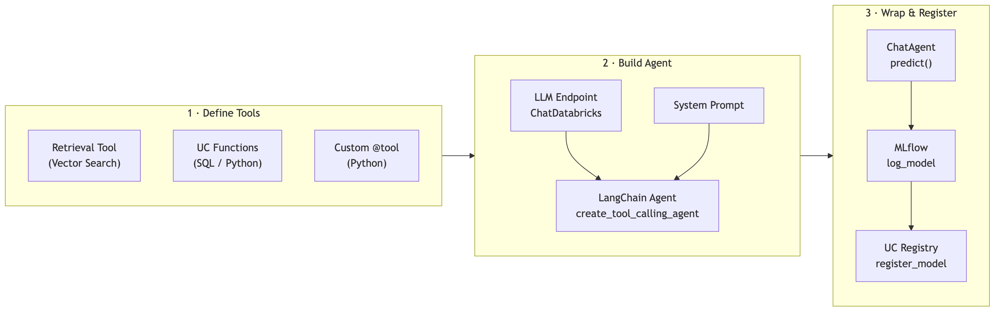
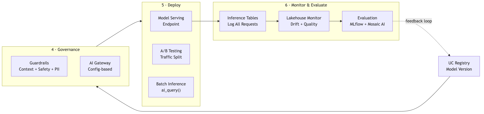

# Agent Framework Cheatsheet

Quick reference for building, deploying, and operating agents on Databricks.

## Building an Agent



---

### 1. Define Tools

Tools give the agent capabilities beyond text generation. The LLM reads each tool's name, description, and parameter schema to decide which tool to call.

#### Retrieval Tool (Vector Search)

A Python function that queries your Vector Search index and returns formatted context. This is the core of any RAG agent.

```python
from databricks.vector_search.client import VectorSearchClient

vsc = VectorSearchClient()
index = vsc.get_index(
    endpoint_name="genai_lab_guide_vs_endpoint",
    index_name="genai_lab_guide.default.arxiv_chunks_index"
)

def retrieve_context(query: str, num_results: int = 3) -> str:
    """Search the knowledge base and return matching text chunks."""
    results = index.similarity_search(
        query_text=query,
        columns=["chunk_text", "path"],   # columns to return
        num_results=num_results,
        query_type="HYBRID"               # best default: semantic + keyword
    )
    # Format results with source attribution
    docs = results.get("result", {}).get("data_array", [])
    parts = []
    for doc in docs:
        source = doc[1].split("/")[-1].replace(".pdf", "")
        parts.append(f"[Source: {source}]\n{doc[0]}")
    return "\n\n---\n\n".join(parts)
```

#### UC Functions (SQL)

Unity Catalog functions are governed, versioned, and automatically discoverable by the LLM via their schema. The `COMMENT` becomes the tool description the LLM sees.

```sql
-- SQL scalar function: looks up paper metadata from a Delta table
CREATE OR REPLACE FUNCTION genai_lab_guide.default.get_paper_metadata(
    paper_name STRING                              -- input: partial paper name
)
RETURNS TABLE (title STRING, chunk_count INT)      -- output: table of results
COMMENT 'Look up paper title and chunk count by name. Use when asked about paper stats.'
RETURN
    SELECT
        REPLACE(element_at(SPLIT(path, '/'), -1), '.pdf', '') AS title,
        COUNT(*) AS chunk_count
    FROM genai_lab_guide.default.arxiv_chunks
    WHERE LOWER(path) LIKE CONCAT('%', LOWER(paper_name), '%')
    GROUP BY path;
```

#### UC Functions (Python)

Use Python UDFs when you need logic that's awkward in SQL (string formatting, regex, external libraries). The `$$` delimiters wrap the Python code.

```sql
-- Python function: formats an APA-style citation
CREATE OR REPLACE FUNCTION genai_lab_guide.default.format_citation(
    authors STRING, title STRING, year INT, arxiv_id STRING
)
RETURNS STRING
LANGUAGE PYTHON
COMMENT 'Format a paper citation in APA style.'
AS $$
def format_citation(authors, title, year, arxiv_id):
    return f"{authors} ({year}). {title}. arXiv:{arxiv_id}."
$$;
```

> **Tip:** When wrapping Python UDFs in a Python f-string (e.g., `spark.sql(f"...")`), escape curly braces by doubling them: `{{authors}}` instead of `{authors}`.

#### Custom Tools (@tool decorator)

Use for arbitrary Python logic that doesn't need UC governance. The docstring becomes the tool description.

```python
from langchain_core.tools import tool

@tool
def search_arxiv_papers(query: str) -> str:
    """Search the arXiv AI/ML papers knowledge base for relevant information.
    Use this tool when the user asks about research papers, ML concepts,
    or specific algorithms."""
    return retrieve_context(query)  # calls the function defined above
```

#### Loading UC Tools into LangChain

`UCFunctionToolkit` wraps UC functions as LangChain-compatible tools. Requires a `DatabricksFunctionClient`.

```python
from unitycatalog.ai.core.databricks import DatabricksFunctionClient
from unitycatalog.ai.langchain.toolkit import UCFunctionToolkit

# Client handles auth and execution of UC functions
client = DatabricksFunctionClient()

toolkit = UCFunctionToolkit(
    function_names=[
        "genai_lab_guide.default.get_paper_metadata",
        "genai_lab_guide.default.format_citation",
    ],
    client=client,   # required — connects to your Databricks workspace
)

# Combine all tools: retrieval + UC functions
all_tools = [search_arxiv_papers] + toolkit.tools
```

---

### 2. Build the Agent

A LangGraph ReAct agent combines an LLM, tools, and a system prompt. The LLM reads the user's question, decides which tool(s) to call, processes the results, and generates a final answer. LangGraph manages the reasoning loop internally — no separate `AgentExecutor` required.

> **Note:** `create_tool_calling_agent` + `AgentExecutor` (the old LangChain pattern) are not available in Databricks Serverless (langchain ≥ 1.2). Use `create_react_agent` from `langgraph.prebuilt` instead.

#### Configure the LLM

```python
from langchain_community.chat_models import ChatDatabricks

# Points to a Foundation Model API endpoint on Databricks
llm = ChatDatabricks(endpoint="databricks-meta-llama-3-3-70b-instruct")
```

#### Create and Run the Agent

The prompt is a plain string passed as the `prompt=` keyword argument — no `ChatPromptTemplate` or `{agent_scratchpad}` needed.

```python
from langgraph.prebuilt import create_react_agent

# System prompt: plain string describing agent behaviour
SYSTEM_PROMPT = """You are an arXiv Research Assistant. You help users understand
AI/ML research papers.

When answering:
1. Always search the knowledge base first
2. Cite the source paper by name
3. If the knowledge base doesn't have the answer, say so clearly"""

# create_react_agent: wires LLM + tools + prompt together; manages the loop internally
agent = create_react_agent(llm, all_tools, prompt=SYSTEM_PROMPT)

# Input is a messages dict (OpenAI-compatible format)
response = agent.invoke({"messages": [{"role": "user", "content": "What is the attention mechanism in transformers?"}]})

# Output: response["messages"] is a list; the last message is the assistant's answer
print(response["messages"][-1].content)
```

---

### 3. Wrap as ChatAgent

`ChatAgent` is Databricks' standard interface for deploying agents to Model Serving. It defines a `predict()` method that takes a list of messages and returns a response.

```python
from mlflow.pyfunc import ChatAgent
from mlflow.types.agent import ChatAgentMessage, ChatAgentResponse

class ArxivResearchAgent(ChatAgent):
    def predict(self, messages, context=None, custom_inputs=None):
        """
        messages:      list of dicts with 'role' and 'content' keys
        context:       optional — request metadata from Model Serving
        custom_inputs: optional — extra parameters from the caller
        """
        # Extract the latest user message
        last_message = messages[-1]["content"]

        # Run through the LangGraph ReAct agent
        response = agent.invoke({"messages": [{"role": "user", "content": last_message}]})

        return ChatAgentResponse(
            messages=[
                ChatAgentMessage(role="assistant", content=response["messages"][-1].content)
            ]
        )
```

---

### 4. Log and Register

MLflow logs the model artifact (code + dependencies). Unity Catalog Registry versions it for deployment.

#### Log with MLflow

```python
import mlflow

# Set experiment (organizes runs in the workspace)
username = spark.sql("SELECT current_user()").first()[0]
mlflow.set_experiment(f"/Users/{username}/genai-lab-guide")

with mlflow.start_run(run_name="arxiv-agent-v1"):
    # Log the ChatAgent class — MLflow captures code + environment
    model_info = mlflow.pyfunc.log_model(
        artifact_path="agent",
        python_model=ArxivResearchAgent,  # the CLASS, not an instance
    )
    print(f"Logged: {model_info.model_uri}")
```

#### Register in Unity Catalog

```python
# Tell MLflow to use UC as the model registry
mlflow.set_registry_uri("databricks-uc")

registered = mlflow.register_model(
    model_uri=model_info.model_uri,
    name="genai_lab_guide.default.arxiv_research_agent"  # catalog.schema.model_name
)
print(f"Registered: version {registered.version}")
```

#### Enable Tracing

Tracing captures every step of agent execution: LLM calls, tool invocations, latencies, inputs/outputs.

```python
# One line — automatically traces all LangChain/LangGraph operations
mlflow.langchain.autolog(log_traces=True)

# After this, every agent.invoke() call generates a trace
# visible in the MLflow Experiment UI → Traces tab
```

---

## Deploying and Operating



---

### 5. Guardrails

Guardrails protect your agent from misuse. Apply them BEFORE the agent runs (input guardrails) and AFTER (output guardrails).

#### Contextual Guardrail — Topic Scope

Restricts the agent to a specific domain. Uses the LLM itself as a classifier.

```python
def contextual_guardrail(user_input: str) -> tuple[bool, str]:
    """Check if the question is within the allowed topic scope."""
    verdict = llm.invoke(
        f"Is this question about AI/ML research? Reply ONLY 'YES' or 'NO'.\n\n"
        f"Question: {user_input}"
    )
    if "NO" in verdict.content.upper():
        return False, "I can only answer questions about AI/ML research papers."
    return True, ""

# Usage: call BEFORE the agent
allowed, message = contextual_guardrail(user_input)
if not allowed:
    return message  # block the request
```

#### Safety Guardrail — PII Detection

Regex-based check for personally identifiable information. Fast, no LLM cost.

```python
import re

PII_PATTERNS = {
    "email": r"[a-zA-Z0-9_.+-]+@[a-zA-Z0-9-]+\.[a-zA-Z0-9-.]+",
    "phone": r"\b\d{3}[-.\s]?\d{3}[-.\s]?\d{4}\b",
    "ssn":   r"\b\d{3}-\d{2}-\d{4}\b",
}

def contains_pii(text: str) -> bool:
    """Returns True if text contains any PII pattern."""
    return any(re.search(p, text) for p in PII_PATTERNS.values())

# Usage: check BOTH input and output
if contains_pii(user_input):
    return "Please remove personal information from your question."
```

#### AI Gateway — Platform-Level Guardrails

Config-based guardrails managed at the Databricks platform level (not in your code). Applied automatically to all requests through the gateway.

```yaml
# Configured via Databricks AI Gateway (UI or API)
guardrails:
  input:
    pii_detection: BLOCK       # block requests containing PII
    safety_filter: BLOCK       # block unsafe/harmful inputs
  output:
    pii_detection: BLOCK       # redact PII from responses
    safety_filter: BLOCK       # block unsafe outputs
```

---

### 6. Model Serving

Deploy your registered model as a REST endpoint. `scale_to_zero_enabled` saves cost for low-traffic endpoints.

#### Deploy an Endpoint

```python
from databricks.sdk import WorkspaceClient
from databricks.sdk.service.serving import EndpointCoreConfigInput, ServedEntityInput

w = WorkspaceClient()

w.serving_endpoints.create_and_wait(
    name="genai-lab-agent-endpoint",
    config=EndpointCoreConfigInput(
        served_entities=[
            ServedEntityInput(
                entity_name="genai_lab_guide.default.arxiv_research_agent",
                entity_version="1",           # model version from UC registry
                workload_size="Small",         # Small | Medium | Large
                scale_to_zero_enabled=True,    # stops billing when idle
            )
        ]
    ),
)
```

#### A/B Testing — Traffic Split

Route a percentage of traffic to different model versions to compare quality.

```python
# Send 70% to v1, 30% to v2
config = EndpointCoreConfigInput(
    served_entities=[
        ServedEntityInput(
            entity_name="genai_lab_guide.default.arxiv_research_agent",
            entity_version="1",
            workload_size="Small",
            scale_to_zero_enabled=True,
            traffic_percentage=70,     # 70% of requests go here
        ),
        ServedEntityInput(
            entity_name="genai_lab_guide.default.arxiv_research_agent",
            entity_version="2",
            workload_size="Small",
            scale_to_zero_enabled=True,
            traffic_percentage=30,     # 30% of requests go here
        ),
    ]
)
```

#### Query the Endpoint

```python
response = w.serving_endpoints.query(
    name="genai-lab-agent-endpoint",
    dataframe_records=[{"input": "What is the transformer architecture?"}]
)
print(response.predictions)
```

#### Batch Inference with ai_query()

Run the model on every row of a table using SQL. Ideal for offline processing.

```sql
-- Call the endpoint for each row in the questions table
SELECT
    question,
    ai_query('genai-lab-agent-endpoint', question)::STRING AS answer
FROM genai_lab_guide.default.test_questions;
```

---

### 7. Evaluation

Evaluate your agent BEFORE deploying (catches problems early) and AFTER (monitors quality in production).

#### Built-in Metrics with MLflow

`model_type="databricks-agent"` automatically computes: relevance, groundedness, safety, and chunk relevance.

```python
import mlflow

results = mlflow.evaluate(
    model="models:/genai_lab_guide.default.arxiv_research_agent/1",
    data=eval_df,                       # DataFrame with 'request' and 'expected_response' columns
    model_type="databricks-agent",      # enables Databricks-specific metrics
)
print(results.metrics)                  # aggregated scores
display(results.tables["eval_results"]) # per-row scores
```

#### Custom LLM-as-Judge

Define your own evaluation criteria when built-in metrics aren't enough. The rubric tells the judge LLM exactly how to score.

```python
from mlflow.metrics.genai import make_genai_metric, EvaluationExample

citation_quality = make_genai_metric(
    name="citation_quality",
    definition="Does the response cite specific paper names and findings?",
    grading_prompt=(
        "Score 1-5:\n"
        "5 = Names the paper, authors, and specific findings\n"
        "3 = Mentions a source vaguely\n"
        "1 = No attribution at all\n"
    ),
    model=f"endpoints:/databricks-meta-llama-3-3-70b-instruct",
    examples=[
        EvaluationExample(
            input="What is the transformer?",
            output="According to Vaswani et al. in 'Attention Is All You Need' (2017)...",
            score=5,
            justification="Names paper, authors, and year."
        ),
    ],
)

# Run with custom metric added
results = mlflow.evaluate(
    model=model_uri,
    data=eval_df,
    model_type="databricks-agent",
    extra_metrics=[citation_quality],   # add custom metrics alongside built-in
)
```

#### Mosaic AI Agent Evaluation

Databricks-native evaluation with specialized metrics for retriever + generator pipelines.

```python
from databricks.agents import evaluate as agent_evaluate

results = agent_evaluate(
    model="genai_lab_guide.default.arxiv_research_agent",
    data=eval_df,
    evaluation_config={
        "metrics": ["groundedness", "relevance", "safety", "chunk_relevance"]
    }
)
```

---

### 8. Monitoring

Inference tables log every request/response automatically. Lakehouse Monitor tracks quality metrics over time and can alert on drift.

#### Enable Inference Tables

Configure during endpoint creation to log all traffic.

```python
from databricks.sdk.service.serving import AutoCaptureConfigInput

# Add auto_capture_config when creating the endpoint
w.serving_endpoints.create_and_wait(
    name="genai-lab-agent-endpoint",
    config=EndpointCoreConfigInput(
        served_entities=[...],
        auto_capture_config=AutoCaptureConfigInput(
            catalog_name="genai_lab_guide",
            schema_name="default",
            table_name_prefix="agent_monitoring",  # creates agent_monitoring_payload table
            enabled=True,
        ),
    ),
)
```

#### Create a Lakehouse Monitor

Profiles the inference table on a schedule, computing drift and quality statistics.

```python
w.quality_monitors.create(
    table_name="genai_lab_guide.default.agent_monitoring_payload",
    output_schema_name="genai_lab_guide.default",
    time_series=MonitorTimeSeries(
        timestamp_col="timestamp",
        granularities=["1 day"],     # compute metrics daily
    ),
)
```

---

## Common Exam Patterns

1. **"When should you use an agent vs a simple chain?"**
   Agent when the task requires dynamic tool selection (e.g., user might ask for data OR a citation). Chain when the steps are always the same.

2. **"What is the ChatAgent interface for?"**
   Standardizes agent deployment to Model Serving. Defines `predict(messages)` → `ChatAgentResponse`.

3. **"What does scale_to_zero mean?"**
   The serving endpoint shuts down when idle (no billing). Starts up on the next request (cold start ~30-60s).

4. **"How does A/B testing work in Model Serving?"**
   Multiple `ServedEntityInput` with `traffic_percentage`. Requests are randomly routed based on the percentages.

5. **"What's the difference between MLflow evaluate and Mosaic AI Agent Evaluation?"**
   MLflow evaluate is general-purpose (works with any model). Agent Evaluation is Databricks-specific with specialized retriever+generator metrics.
