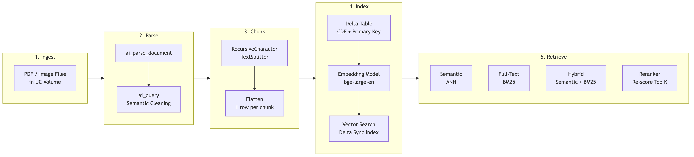

# RAG Pipeline Cheatsheet

Quick reference for building RAG (Retrieval-Augmented Generation) pipelines on Databricks.



---

## 1. Document Parsing

`ai_parse_document()` extracts structured content (text, tables, images) from binary files stored in a Unity Catalog Volume. It's the first step in any RAG pipeline — turning raw PDFs into text you can chunk and embed.

### SQL Syntax

```sql
-- Parse all PDFs in a volume and extract text + tables + images
SELECT
  path,
  ai_parse_document(
    content,                          -- binary column from read_files
    map('version', '2.0')             -- parser version (always use '2.0')
  ) AS parsed
FROM read_files(
  '/Volumes/genai_lab_guide/default/arxiv_papers/',
  format => 'binaryFile'             -- reads files as raw bytes
);
```

### Python Syntax

```python
from pyspark.sql.functions import expr

# Load PDFs as binary — each row = one file
docs_df = spark.read.format("binaryFile").load(
    "/Volumes/genai_lab_guide/default/arxiv_papers/"
)

# Parse each document — adds a complex VARIANT column
parsed_df = docs_df.withColumn(
    "parsed",
    expr("ai_parse_document(content, map('version', '2.0'))")
)

# Save to table (VARIANT type works best queried via SQL)
parsed_df.select("path", "parsed").write.saveAsTable("genai_lab_guide.default.parsed_docs")
```

### Output Structure

| Field | Type | Description |
|-------|------|-------------|
| `document.pages` | Array | List of page objects, each with `page_number` and `text` |
| `document.elements` | Array | Individual content blocks: paragraphs, headings, tables, figures |
| `error_status` | String | `null` on success; error message on failure |
| `metadata` | Struct | File-level info: page count, format, dimensions |

### Supported Formats

| Format | How It Works |
|--------|-------------|
| PDF | Layout-aware text extraction, table detection, image extraction |
| PNG / JPEG / TIFF | OCR (optical character recognition) applied automatically |

---

## 2. Text Cleaning

Raw parsed text typically contains artifacts: broken lines, orphaned headers, page numbers, inconsistent spacing. You have two cleaning approaches with very different cost profiles.

### LLM Cleaning with ai_query() — Higher Quality

Use when document quality matters (production pipelines, complex layouts). Costs LLM tokens.

```sql
-- Clean parsed text using an LLM to remove artifacts
-- The model preserves content and structure while removing noise
SELECT
  path,
  ai_query(
    'databricks-meta-llama-3-1-8b-instruct',   -- cheapest model, sufficient for cleaning
    CONCAT(
      'Clean this academic paper text. ',
      'Remove headers, footers, page numbers, and broken lines. ',
      'Preserve all content and section structure exactly. ',
      'Return only the cleaned text.\n\n',
      raw_text                                    -- the column containing extracted text
    )
  )::STRING AS cleaned_text                       -- ::STRING extracts text from VARIANT result
FROM raw_texts;
```

### Simple Concatenation — Budget Alternative

Use for prototyping or when documents are already clean. Free (no LLM calls).

```python
from pyspark.sql.functions import concat_ws, collect_list

# Just concatenate all page text with double newlines between pages
cleaned_df = pages_df.groupBy("path").agg(
    concat_ws("\n\n", collect_list("page_text")).alias("cleaned_text")
)
```

### Quality vs Cost

| Approach | Quality | Cost | Best For |
|----------|---------|------|----------|
| `ai_query()` with LLM | High — removes artifacts, preserves structure | ~$0.01-0.05 per doc | Production, complex PDFs |
| `concat_ws()` | Low — keeps all artifacts | Free | Prototyping, clean source docs |

---

## 3. Chunking

Chunks are the units that get embedded and retrieved. Size matters: too small loses context, too big loses retrieval precision. Overlap prevents cutting important information at chunk boundaries.

### RecursiveCharacterTextSplitter

The most common chunking strategy. It tries to split at the largest semantic boundary first, falling back to smaller ones:

**paragraph** (`\n\n`) → **line** (`\n`) → **sentence** (`. `) → **word** (` `) → **character** (`""`)

```python
from langchain_text_splitters import RecursiveCharacterTextSplitter

splitter = RecursiveCharacterTextSplitter(
    chunk_size=1000,        # max characters per chunk (~250 tokens)
    chunk_overlap=200,      # characters shared between adjacent chunks
    separators=[            # try these boundaries in order (largest first)
        "\n\n",             # paragraph breaks
        "\n",               # line breaks
        ". ",               # sentence ends
        " ",                # word breaks
        ""                  # character-level (last resort)
    ]
)

# Split a document into chunks
chunks = splitter.split_text(document_text)
# Returns: ["chunk 1 text...", "chunk 2 text...", ...]
```

### How to Choose Chunk Size

| Situation | Recommended Size | Why |
|-----------|-----------------|-----|
| Short, precise answers needed | 300-500 chars | Higher retrieval precision |
| General Q&A over documents | 500-1000 chars | Good balance of context and precision |
| Summarization / long-form | 1000-2000 chars | More context per retrieval |

**Start with 500-1000 characters and benchmark with your evaluation dataset.** There's no universal best size.

### Chunking Trade-offs

| Dimension | Smaller Chunks | Larger Chunks |
|-----------|---------------|---------------|
| Retrieval precision | Higher (more specific matches) | Lower (broader matches) |
| Number of embeddings | More (higher storage cost) | Fewer (lower storage cost) |
| Context per result | Less (may miss surrounding info) | More (includes related content) |
| Overlap importance | Critical (small chunks lose more at boundaries) | Less critical |

---

## 4. Embedding Models

Embeddings convert text chunks into numeric vectors for similarity search. Databricks provides hosted embedding endpoints — no infrastructure to manage.

### Available Models

| Model | Size | Dimensions | Context | Cost | When to Use |
|-------|------|-----------|---------|------|-------------|
| `databricks-bge-large-en` | 0.44 GB | 1024 | 512 tokens | Higher | Production, quality matters |
| `databricks-bge-small-en` | 0.13 GB | 384 | 512 tokens | Lower | Prototyping, cost-sensitive |
| `databricks-gte-large-en` | 0.44 GB | 1024 | 512 tokens | Higher | Alternative to BGE |

### Calling an Embedding Endpoint

```python
from mlflow.deployments import get_deploy_client

client = get_deploy_client("databricks")

response = client.predict(
    endpoint="databricks-bge-large-en",
    inputs={"input": ["Text to embed"]}  # can pass multiple strings
)

# Result: list of 1024 floats (for bge-large)
embedding = response["data"][0]["embedding"]
print(f"Dimensions: {len(embedding)}")  # 1024
```

### Rule of Thumb

Match the model's **max context length** to your **chunk size**. Both BGE models support 512 tokens (~2000 chars). If your chunks are under 2000 chars, either model works. Pick based on cost vs quality needs.

---

## 5. Vector Search

Vector Search stores embeddings and enables fast similarity lookup. **Delta Sync** keeps the index automatically synchronized with your source Delta table — when rows change, the index updates.

### Prerequisites (Exam Favorite)

Two things MUST be true about your source Delta table:

1. **Unique primary key column** — Vector Search needs a stable row ID to track updates
2. **Change Data Feed (CDF) enabled** — allows Delta Sync to detect which rows changed

```sql
-- Enable CDF on an existing table
ALTER TABLE genai_lab_guide.default.arxiv_chunks
SET TBLPROPERTIES ('delta.enableChangeDataFeed' = 'true');
```

### Create Endpoint + Index

```python
from databricks.vector_search.client import VectorSearchClient

vsc = VectorSearchClient()

# Step 1: Create a Vector Search endpoint (the compute that serves queries)
# WARNING: This bills ~$0.50-1.00/hr while running. Delete when done!
vsc.create_endpoint(
    name="genai_lab_guide_vs_endpoint",
    endpoint_type="STANDARD"
)

# Step 2: Create a Delta Sync index with managed embeddings
# Databricks computes embeddings automatically using the specified model
vsc.create_delta_sync_index(
    endpoint_name="genai_lab_guide_vs_endpoint",
    index_name="genai_lab_guide.default.arxiv_chunks_index",
    source_table_name="genai_lab_guide.default.arxiv_chunks",
    pipeline_type="TRIGGERED",            # sync on demand (vs CONTINUOUS)
    primary_key="chunk_id",               # unique ID column
    embedding_source_column="chunk_text", # column to embed
    embedding_model_endpoint_name="databricks-bge-large-en"
)
```

### Query Types

| Type | Syntax | How It Works | When to Use |
|------|--------|-------------|-------------|
| **Semantic** (ANN) | `query_type="ANN"` | Embedding similarity (cosine/dot product) | Default. Best for natural language queries |
| **Full-Text** | `query_type="FULL_TEXT"` | BM25 keyword matching | When exact terms matter (names, codes, IDs) |
| **Hybrid** | `query_type="HYBRID"` | Combines semantic + keyword scores | Generally best overall. Use as default in production |

```python
# Example: hybrid search (recommended default)
results = index.similarity_search(
    query_text="How does attention work in transformers?",
    columns=["chunk_id", "path", "chunk_text"],
    num_results=5,
    query_type="HYBRID"
)
```

### Adding a Reranker

A reranker **re-scores** the top-k retrieved results for better precision. It does **NOT** add new documents — it only reorders what was already retrieved.

```python
results = index.similarity_search(
    query_text="How does LoRA reduce fine-tuning cost?",
    columns=["chunk_id", "path", "chunk_text"],
    num_results=5,
    query_type="HYBRID",
    reranker={
        "reranker_model_endpoint_name": "databricks-reranker-v1"
    }
)
```

---

## 6. Quick Reference

### Key SQL Functions

| Function | Purpose | Example |
|----------|---------|---------|
| `ai_parse_document()` | Parse binary docs to structured output | `ai_parse_document(content, map('version','2.0'))` |
| `ai_query()` | Call any LLM endpoint inline in SQL | `ai_query('endpoint-name', prompt)` |
| `read_files()` | Load files as a DataFrame | `read_files(path, format => 'binaryFile')` |
| `LIST` | Inspect files in a volume | `LIST '/Volumes/cat/sch/vol/'` |

### Common Exam Patterns

1. **"What are the prerequisites for Delta Sync Vector Search?"**
   Unique primary key column + Change Data Feed enabled.

2. **"Which function parses documents in Databricks?"**
   `ai_parse_document()`. Not `ai_query()` (that's for LLM inference).

3. **"How to reduce the number of embeddings when you exceed storage limits?"**
   Increase chunk size → fewer chunks per document → fewer embeddings.

4. **"What does a reranker do?"**
   Re-scores and reorders the top-k retrieved results. Does NOT retrieve additional documents.
