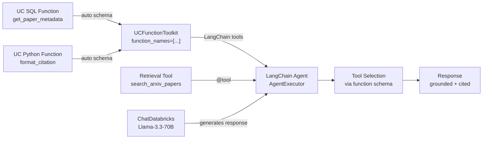

# Lab 04 Workbook: UC Functions as Agent Tools

**Exam Domain:** Application Development (30%)
**Time:** ~25 minutes | **Cost:** ~$1–2

---

## Architecture Diagram

---

## Time and Cost

| Resource | Estimated Cost |
|---|---|
| Databricks Serverless compute | ~$0.50 |
| LLM token usage (test queries) | ~$0.50 |
| **Total** | **~$1–2** |

---

## What Was Done

### Step 1 — Create the SQL UC Function

**What:** Wrote `get_paper_metadata(paper_name STRING)` as a `RETURNS TABLE` SQL UDF in Unity Catalog. The function queries `arxiv_chunks`, filters by `LOWER(path) LIKE` match on the input string, and groups by `path` to count chunks per paper.

**Why:** SQL UDFs are ideal for set-based lookups and aggregations over Delta tables. Storing the logic in UC means any notebook, job, or agent with `EXECUTE` privilege can call it without duplicating the SQL. The `COMMENT` on the function becomes the tool description the LLM reads when deciding whether to invoke it.

**Result:** A callable, versioned function visible in the Catalog Explorer that returns `(path, chunk_count)` rows for any paper name fragment — confirmed with a smoke-test query for `'attention'`.

**Exam tip:** Know the syntax difference — SQL UDFs use `RETURNS TABLE (col1 TYPE, ...)` with a `RETURN SELECT ...` body. Python UDFs use `RETURNS scalar_type LANGUAGE PYTHON AS $$ ... $$`.

---

### Step 2 — Create the Python UC Function

**What:** Wrote `format_citation(authors, title, year, arxiv_id)` as a scalar Python UDF that returns an APA-style formatted citation string using standard Python string interpolation.

**Why:** Python UDFs handle logic that is awkward in SQL — string formatting, conditionals, external library calls (within the sandbox). Keeping citation formatting in a UC function means the agent never needs to prompt the LLM to do string manipulation; it delegates to a deterministic function instead.

**Result:** A scalar UC function that returns a correctly formatted APA citation string, confirmed with a test call for Vaswani et al. 2017.

**Exam tip:** Python UDFs in UC are sandboxed — they cannot make network calls or import arbitrary third-party packages. Use them for CPU-bound transformations, not I/O.

---

### Step 3 — Explore Tool Schemas

**What:** Used `WorkspaceClient().functions.list(catalog_name=..., schema_name=...)` to iterate over all UC functions in the schema and printed each function's `full_name`, `comment`, and parameter list (`input_params.parameters`).

**Why:** The LLM selects tools based on the schema it receives — specifically the function name and `COMMENT` field. Understanding what metadata is exposed helps you write better tool descriptions and debug unexpected tool selection behaviour.

**Result:** Printed the full schema for `get_paper_metadata` and `format_citation`, confirming the comments and parameter types that will be injected into the LLM's context by `UCFunctionToolkit`.

**Exam tip:** `UCFunctionToolkit` reads this same schema automatically. You do not write JSON tool schemas by hand — the `COMMENT` on the UC function *is* the tool description.

---

### Step 4 — Combine Tools in a Multi-Tool Agent

**What:** Rebuilt the `search_arxiv_papers` retrieval tool from Lab 03, instantiated `UCFunctionToolkit(function_names=[...])` to convert the two UC functions into LangChain tools, merged all three into `all_tools`, and built a `create_tool_calling_agent` + `AgentExecutor` that uses all three tools. Tested with a compound query requiring metadata lookup, passage retrieval, and citation formatting simultaneously.

**Why:** Real-world agents rarely use a single tool. Combining a retrieval tool with UC-backed utility functions demonstrates how to build agents that can both answer content questions and perform structured data operations in a single reasoning loop.

**Result:** The agent correctly dispatched across all three tools — calling `get_paper_metadata` for chunk statistics, `search_arxiv_papers` for content, and `format_citation` for the reference — and returned a unified response.

**Exam tip:** `UCFunctionToolkit(function_names=[f"{CATALOG}.{SCHEMA}.fn_name"])` uses the three-part UC name. Always include the catalog and schema prefix.

---

## Key Concepts

| Concept | Definition |
|---|---|
| **UC Function** | A SQL or Python function stored in Unity Catalog, versioned, permissioned, and discoverable via the Catalog Explorer |
| **SQL UDF** | A UC function written in Spark SQL using `CREATE FUNCTION ... RETURNS TABLE ... RETURN SELECT ...` — best for set-based operations over Delta tables |
| **Python UDF** | A UC function written in Python using `LANGUAGE PYTHON AS $$ ... $$` — best for scalar transformations and formatting logic |
| **UCFunctionToolkit** | LangChain integration (`unitycatalog-langchain`) that reads UC function schemas and converts them into LangChain `Tool` objects automatically |
| **Tool Schema** | The name, description, and parameter definitions exposed to the LLM so it can decide when and how to call a tool; sourced from the UC function `COMMENT` and parameter types |
| **AI Playground** | Databricks UI for testing Foundation Model endpoints; supports adding UC functions as tools interactively without writing agent code |
| **Tool Calling** | The LLM capability to emit structured function-call requests (name + arguments) that the agent runtime executes and feeds back as observations |

---

## Exam Practice Questions

**Q1.** Which UC function type should you use to return multiple rows from a Delta table based on an input filter?

- A) `RETURNS STRING LANGUAGE PYTHON`
- B) `RETURNS TABLE (...) RETURN SELECT ...`
- C) `RETURNS INT LANGUAGE SQL`
- D) `RETURNS STRUCT<...>`

**Answer: B** — `RETURNS TABLE` is the SQL UDF syntax for table-valued functions that return multiple rows. Python UDFs return scalar values only.

---

**Q2.** How does an LLM know when to call a UC function that has been added as an agent tool?

- A) The agent hardcodes a routing table mapping intent keywords to tool names
- B) The LLM reads the function's name and `COMMENT` field from the tool schema injected into its context
- C) The agent calls every available tool and picks the best response
- D) The LLM ignores tool metadata and relies solely on few-shot examples in the prompt

**Answer: B** — The LLM uses the tool schema (name + description from the `COMMENT`) to decide which tool matches the user's intent. Well-written comments are essential for correct tool selection.

---

**Q3.** What is the key difference between a UC SQL UDF and a UC Python UDF?

- A) SQL UDFs run on the driver; Python UDFs run on executors
- B) SQL UDFs can only return scalars; Python UDFs can return tables
- C) SQL UDFs use set-based Spark SQL syntax and can return tables; Python UDFs use Python logic and return scalars
- D) Python UDFs require a running cluster; SQL UDFs run serverlessly

**Answer: C** — SQL UDFs (`RETURNS TABLE`) are set-based and leverage Spark SQL optimiser; Python UDFs return scalar values and are evaluated row-by-row.

---

**Q4.** Which class converts Unity Catalog functions into LangChain-compatible tool objects?

- A) `DatabricksFunctionToolkit`
- B) `SparkUDFTool`
- C) `UCFunctionToolkit`
- D) `MLflowFunctionTool`

**Answer: C** — `UCFunctionToolkit` from the `unitycatalog-langchain` package reads UC function metadata and returns a list of LangChain `Tool` objects ready to pass to `create_tool_calling_agent`.

---

**Q5.** When should you prefer a UC function over a LangChain `@tool` for agent tool logic?

- A) When the logic needs to make outbound HTTP calls at runtime
- B) When the tool must return streaming responses
- C) When the logic involves querying Delta tables, needs UC governance (permissions, lineage), or must be shared across multiple agents and notebooks
- D) When you need the tool to run faster than UC function cold-start latency allows

**Answer: C** — UC functions are the right choice when the logic operates on data in the Lakehouse, needs to be governed by Unity Catalog ACLs, or must be reused across teams without code duplication. LangChain `@tool` is better for ephemeral, session-scoped logic or when external API calls are required.

---

## Cost Breakdown

| Component | Detail | Estimated Cost |
|---|---|---|
| Databricks Serverless compute | UC function creation + notebook execution (~15 min DBU) | ~$0.50 |
| LLM token usage | Multi-tool test query + tool schema injection overhead | ~$0.50 |
| Vector Search queries | Retrieval calls during multi-tool agent test | Included in serverless |
| **Total** | | **~$1–2** |

> Costs vary by workspace region and current DBU pricing. Use the Databricks Cost Dashboard to track actuals.
