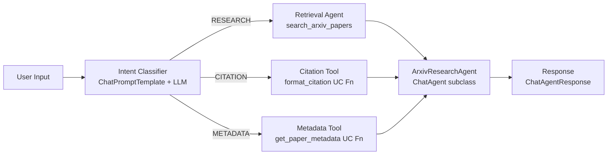

# Lab 05 Workbook: Single Agent with LangChain

**Exam Domain:** Application Development (30%)
**Time:** ~35 minutes | **Cost:** ~$1–2

---

## Architecture Diagram

---

## Time and Cost

| Resource | Estimated Cost |
|---|---|
| Databricks Serverless compute | ~$0.50 |
| LLM token usage (classifier + agent calls) | ~$0.50 |
| **Total** | **~$1–2** |

---

## What Was Done

### Step 1 — Build Multi-Tool Agent

**What:** Combined `search_arxiv_papers` (Vector Search retrieval, Lab 03), `get_paper_metadata` (UC SQL function, Lab 04), and `format_citation` (UC Python function, Lab 04) into a single `AgentExecutor` using `create_tool_calling_agent`. Tested with a compound query that required all three tools simultaneously.

**Why:** A multi-tool agent is the foundational pattern for production AI assistants. The LLM reads each tool's name and description to select the right tool(s) per sub-task, synthesising a unified response without hardcoded routing logic.

**Result:** A working `AgentExecutor` with three tools that correctly dispatches across retrieval, metadata lookup, and citation formatting in a single reasoning loop.

**Exam tip:** `all_tools = [langchain_tool] + uc_toolkit.tools` is the idiomatic way to merge `@tool`-decorated functions with UC function tools from `UCFunctionToolkit`.

---

### Step 2 — Intent Classification

**What:** Built a `classifier_chain` using `ChatPromptTemplate | llm | StrOutputParser()` that classifies any user query into `RESEARCH`, `CITATION`, or `METADATA`. Created a `route_query()` function that calls the classifier, selects the matching system prompt from `INTENT_PROMPTS`, and builds a fresh `AgentExecutor` for that intent. Tested with one query per intent class.

**Why:** Pre-classifying intent before invoking the agent reduces unnecessary tool calls (the LLM only considers the tools relevant to the classified intent), improves response quality (intent-specific system prompt), and adds an observable routing step that appears in MLflow traces.

**Result:** Three test queries each received the correct intent label and routed to the right tool. The classifier added one LLM call but eliminated speculative tool invocations.

**Exam tip:** An intent classifier is a **multi-step workflow** — a pattern the exam distinguishes from a plain single-agent setup. Know when to use it: use a classifier when you have distinct, non-overlapping intents with different tool requirements.

---

### Step 3 — ChatAgent Wrapper

**What:** Defined `ArxivResearchAgent(ChatAgent)` with a `predict(messages, context=None) -> ChatAgentResponse` method. Inside `predict()`, the agent extracts the last user message, classifies intent, builds the routed prompt, invokes the `AgentExecutor`, and wraps the output in `ChatAgentResponse(messages=[ChatAgentMessage(role="assistant", content=...)])`. Smoke-tested the class directly with a `ChatAgentMessage` input.

**Why:** Databricks Model Serving validates that deployed models conform to the `ChatAgent` interface. Inheriting from `ChatAgent` and implementing `predict()` is the required pattern for:
- Deploying via Databricks Model Serving
- Using the Databricks Review App for human evaluation
- AI Gateway compatibility
- Automatic MLflow tracing

**Result:** `ArxivResearchAgent().predict([ChatAgentMessage(role="user", content="...")])` returns a properly structured `ChatAgentResponse` confirming Model Serving compatibility.

**Exam tip:** The `predict()` signature is fixed: `(self, messages: list[ChatAgentMessage], context: Optional[dict] = None) -> ChatAgentResponse`. Memorise it — the exam tests the exact parameter names and return type.

---

### Step 4 — Log and Register

**What:** Logged `ArxivResearchAgent()` using `mlflow.pyfunc.log_model(python_model=..., signature=..., pip_requirements=[...])` inside `mlflow.start_run()`. Logged run parameters (LLM endpoint, intent classes, VS index, tool count). Registered the resulting artifact in Unity Catalog using `mlflow.register_model(model_uri=..., name=f"{CATALOG}.{SCHEMA}.arxiv_chat_agent")`.

**Why:** MLflow logging creates a versioned, reproducible artifact that captures the exact code, dependencies, and signature needed to serve the model. UC registration makes the model discoverable, permissioned, and deployable via Model Serving with one click.

**Result:** A registered model version at `genai_lab_guide.default.arxiv_chat_agent` ready for deployment to a real-time serving endpoint.

**Exam tip:** Always call `mlflow.set_registry_uri("databricks-uc")` before `mlflow.register_model`. Without this, the model registers in the legacy Workspace registry, not Unity Catalog.

---

## Key Concepts

| Concept | Definition |
|---|---|
| **Multi-Step Workflow** | An agent pipeline where the output of one step (e.g. intent classification) controls the behaviour of the next step (e.g. tool selection and prompt construction) |
| **Intent Classification** | A lightweight LLM chain that maps free-text user input to a discrete label, used to route queries to specialised sub-agents or tool subsets |
| **ChatAgent** | Databricks base class (`databricks.agents.ChatAgent`) for building Model Serving-compatible agents; requires implementing `predict(messages, context)` |
| **Tool Calling Agent** | A LangChain agent pattern (`create_tool_calling_agent`) where the LLM emits structured tool-call requests and the `AgentExecutor` handles the observe-act loop |
| **AgentExecutor** | LangChain runtime that manages the tool-calling loop: invoke agent → parse tool calls → execute tools → feed observations back → repeat until final answer |
| **ChatAgentResponse** | The return type of `ChatAgent.predict()` — a wrapper containing a list of `ChatAgentMessage` objects conforming to the OpenAI message schema |
| **Model Signature** | The input/output schema attached to an MLflow model; required for Model Serving validation and automatic request/response schema enforcement |

---

## Exam Practice Questions

**Q1.** A developer wants to route user queries to different tool subsets depending on whether the query is a content question, a citation request, or a metadata lookup. Which pattern best describes this approach?

- A) Single-agent with all tools loaded simultaneously
- B) Multi-step workflow with intent classification routing
- C) Multi-agent orchestration with a supervisor agent
- D) Retrieval-augmented generation without tool calling

**Answer: B** — Classifying intent before invoking the agent is a multi-step workflow. The classifier output controls which tools and system prompt are used in the next step. Single-agent (A) loads all tools but does not pre-route. Multi-agent (C) involves separate agents, not a classifier. RAG alone (D) does not address routing.

---

**Q2.** What is the key difference between `AgentExecutor` and `ChatAgent` in the Databricks ecosystem?

- A) `AgentExecutor` is for multi-turn conversations; `ChatAgent` is for single-turn only
- B) `AgentExecutor` manages the tool-calling loop at runtime; `ChatAgent` is a Databricks interface class that wraps an agent for Model Serving compatibility
- C) `AgentExecutor` requires Unity Catalog tools; `ChatAgent` supports any LangChain tool
- D) `ChatAgent` automatically handles multi-agent orchestration; `AgentExecutor` does not

**Answer: B** — `AgentExecutor` is the LangChain runtime that executes the observe-act loop. `ChatAgent` is a Databricks interface class whose `predict()` method makes any agent compatible with Model Serving, the Review App, and the AI Gateway. They are complementary: `AgentExecutor` runs inside the `ChatAgent.predict()` method.

---

**Q3.** When should you use a multi-agent architecture instead of a single agent with intent routing?

- A) Whenever you have more than two intent classes
- B) When the agent needs to call more than three tools
- C) When sub-tasks require genuinely independent reasoning loops, specialised prompts, or different LLMs that cannot be collapsed into a single `AgentExecutor`
- D) When deploying to Model Serving, which requires one agent per endpoint

**Answer: C** — Multi-agent is appropriate when sub-tasks have fundamentally different requirements (different LLMs, isolated tool sets, parallel execution) or when a single agent's context window cannot fit all required tools and instructions. Simple intent routing within a single agent is sufficient for most cases with overlapping tools.

---

**Q4.** What is the required method signature for a class that inherits from `ChatAgent`?

- A) `def run(self, query: str) -> str`
- B) `def invoke(self, inputs: dict) -> dict`
- C) `def predict(self, messages: list[ChatAgentMessage], context: Optional[dict] = None) -> ChatAgentResponse`
- D) `def generate(self, prompt: str, max_tokens: int) -> str`

**Answer: C** — The `ChatAgent` interface requires exactly `predict(self, messages, context=None) -> ChatAgentResponse`. The exam tests this signature directly. Any other method name or signature will cause Model Serving deployment to fail.

---

**Q5.** An intent classifier returns `RESEARCH` for 80% of queries, `CITATION` for 15%, and `METADATA` for 5%. A developer proposes removing the classifier and letting the single agent select tools freely. What is the main trade-off?

- A) Without the classifier, the agent cannot use UC function tools
- B) Without the classifier, the agent may make speculative tool calls for CITATION and METADATA queries that do not require retrieval, increasing latency and token cost
- C) Without the classifier, MLflow tracing stops working
- D) Without the classifier, the ChatAgent interface is no longer valid

**Answer: B** — A single agent without a classifier may call multiple tools to "cover its bases," especially for ambiguous queries. The classifier eliminates speculative calls by constraining the agent's tool selection before the reasoning loop begins, reducing latency and cost. Options A, C, and D are incorrect — tool availability, MLflow tracing, and the ChatAgent interface are independent of whether a classifier is present.

---

## Cost Breakdown

| Component | Detail | Estimated Cost |
|---|---|---|
| Databricks Serverless compute | Notebook execution + UC function calls (~20 min DBU) | ~$0.50 |
| LLM token usage | Classifier call + routed agent call per test query (6 total calls) | ~$0.50 |
| Vector Search queries | Retrieval calls during RESEARCH intent tests | Included in serverless |
| **Total** | | **~$1–2** |

> Costs vary by workspace region and current DBU pricing. Use the Databricks Cost Dashboard to track actuals.
