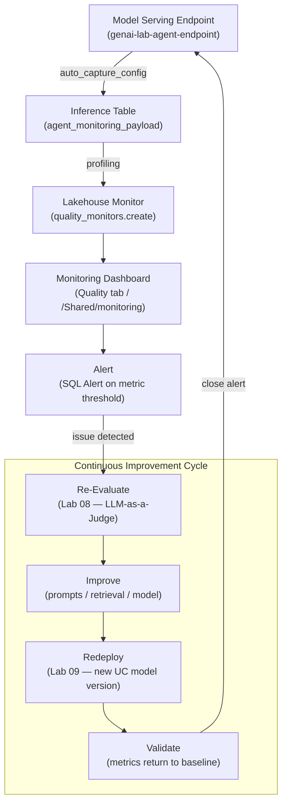

# Lab 10 Workbook: Monitoring & Observability

**Exam Domain:** Evaluation and Monitoring (12%)

---

## Architecture Diagram

---

## Time & Cost Estimate

| Item | Value |
|---|---|
| **Estimated time** | 30 minutes |
| **Estimated cost** | $2 – $3 |

See detailed breakdown in the [Cost Breakdown](#cost-breakdown) section below.

---

## What Was Done

### Step 1 — Enable Inference Tables

**What:** Updated the serving endpoint's `auto_capture_config` via `WorkspaceClient` to enable automatic logging of all requests and responses to `genai_lab.default.agent_monitoring_payload`.

**Why:** Inference tables are the foundation of all monitoring. Without persisted request/response data, it is impossible to detect drift, audit decisions, or run retrospective evaluations. Logging is enabled at the serving layer so no application code changes are needed.

**Result:** Every subsequent request to `genai-lab-agent-endpoint` is written as a row in the Delta inference table with timestamp, request body, response body, latency, and status code.

**Exam tip:** `auto_capture_config` is set on the endpoint configuration, not on the model. It can be toggled on/off via `update_config` without redeploying served entities or restarting the endpoint.

---

### Step 2 — Generate Traffic

**What:** Sent 8 representative natural-language queries to the endpoint using `w.serving_endpoints.query`, with a 2-second pause between requests.

**Why:** The inference table must contain data before the Lakehouse Monitor can compute meaningful profiles. Sending a variety of queries also populates the table with realistic input distributions for drift baseline computation.

**Result:** 8 rows captured in `agent_monitoring_payload`; each row contains the full request/response JSON and `execution_time_ms` for latency analysis.

**Exam tip:** The monitor computes statistics over time windows (e.g., `1 day`). A freshly populated inference table will show one window; multiple days of traffic are needed to observe trends and drift.

---

### Step 3 — Inspect Inference Logs

**What:** Queried the inference table directly with `spark.sql` to count captured rows and display the most recent entries, including `timestamp`, `request`, `response`, `execution_time_ms`, and `status_code`.

**Why:** Verifying the inference table contents confirms that logging is working correctly and that the data quality is sufficient for monitoring. It also demonstrates that inference tables are queryable Delta tables — not a proprietary format.

**Result:** A display showing the 10 most recent inference records, confirming all 8 test queries were captured with HTTP 200 status codes and sub-second latency.

**Exam tip:** Inference tables use the standard Delta table format and are registered in Unity Catalog. They support time travel, OPTIMIZE, VACUUM, and all other Delta operations.

---

### Step 4 — Create Lakehouse Monitor

**What:** Created a `MonitorInferenceLog` monitor over the inference table using `w.quality_monitors.create`, specifying `1 day` granularity, `timestamp` as the time column, and `PROBLEM_TYPE_QUESTION_ANSWERING`. Triggered the first refresh with `run_refresh`.

**Why:** The Lakehouse Monitor automates statistical profiling on a schedule. Without it, detecting drift or quality regressions would require writing and maintaining custom SQL queries. The monitor computes profile metrics and drift metrics as separate Delta tables that feed the dashboard.

**Result:** Monitor created and first refresh triggered. Dashboard visible under the **Quality** tab of the inference table in Unity Catalog Explorer, and as a Databricks dashboard at `/Shared/monitoring/lab10`.

**Exam tip:** Lakehouse Monitor outputs are stored as Delta tables: `<table>_profile_metrics` and `<table>_drift_metrics`. You can query these directly with SQL to build custom alerts or integrate with external monitoring systems.

---

### Step 5 — Feedback Loop

**What:** Reviewed the end-to-end MLOps feedback cycle: monitoring detects an issue → alert fires → re-evaluate with LLM-as-a-Judge (Lab 08) → improve the pipeline → redeploy via UC model registry (Lab 09) → validate that metrics recover.

**Why:** Monitoring is only valuable when its outputs drive action. Understanding the full feedback loop demonstrates that Lab 10 is the closing step of a continuous improvement cycle, not an isolated observability bolt-on.

**Result:** Clear mapping of each loop stage to a specific lab and SDK operation, confirming that the inference table is the integration point between production behaviour and the evaluation/training pipeline.

**Exam tip:** The exam frequently asks about the correct order of stages in the feedback loop. The canonical order is: **detect → evaluate → improve → deploy → validate**. Skipping the evaluation step (jumping from alert directly to redeploy) is a common incorrect answer.

---

## Key Concepts

| Concept | Definition |
|---|---|
| **Inference Table** | A Delta table in Unity Catalog automatically populated with every request/response pair sent to a Model Serving endpoint; the raw data source for all monitoring |
| **`auto_capture_config`** | SDK configuration object (`AutoCaptureConfigInput`) that enables inference logging on a serving endpoint; specifies `catalog_name`, `schema_name`, `table_name_prefix`, and `enabled` flag |
| **Lakehouse Monitor** | Databricks managed service that profiles a Delta table on a schedule and produces statistical metrics, drift scores, and data quality reports; created via `w.quality_monitors.create` |
| **Quality Metrics** | Per-column statistics (null rate, min/max, distribution) and endpoint-level metrics (error rate, request volume) computed by the Lakehouse Monitor for each time window |
| **Drift Detection** | Statistical comparison of input/output column distributions against a reference (baseline) window using Jensen-Shannon divergence; surfaces distribution shift that may indicate model staleness |
| **Feedback Loop** | The continuous MLOps cycle: Monitor → Alert → Re-evaluate (Lab 08) → Improve → Redeploy (Lab 09) → Validate → Monitor; inference tables are the bridge between production and offline pipelines |
| **Alert** | A Databricks SQL Alert attached to a monitor metric query; fires a notification (email, Slack, PagerDuty) when a metric crosses a defined threshold |

---

## Exam Questions

**Q1.** You want all requests sent to a Databricks Model Serving endpoint to be automatically logged to a Delta table in Unity Catalog. Which configuration object do you use?

- A) `LoggingConfig` in `EndpointCoreConfigInput`
- B) `AutoCaptureConfigInput` passed to `update_config` on the endpoint
- C) A Delta Live Tables pipeline reading from the endpoint access logs
- D) `MLflowTrackingConfig` attached to the served entity

**Answer: B.** `AutoCaptureConfigInput` with `enabled=True` is the correct mechanism. It is set via `w.serving_endpoints.update_config`, not on the model registration.

---

**Q2.** A Lakehouse Monitor is created over an inference table with `granularities=["1 day"]`. Where are the computed statistics stored?

- A) In MLflow as a run artifact
- B) As JSON files in DBFS under `/tmp/monitor_output`
- C) As Delta tables named `<inference_table>_profile_metrics` and `<inference_table>_drift_metrics` in Unity Catalog
- D) Only in the dashboard; they cannot be queried via SQL

**Answer: C.** The monitor writes profile and drift metrics to queryable Delta tables in the same schema as the monitored table, enabling SQL-based analysis and custom alerting.

---

**Q3.** Your inference table shows that the Jensen-Shannon divergence for the `request` column has increased sharply over the past week compared to the baseline. What does this most likely indicate?

- A) The serving endpoint is experiencing higher latency
- B) The input distribution has shifted — users are asking different types of questions than at baseline
- C) The model's responses are getting shorter
- D) The inference table has duplicate rows caused by retry logic

**Answer: B.** Jensen-Shannon divergence measures how much the current distribution differs from the reference. An increase indicates distributional drift in the inputs, which may mean the model is operating outside its training distribution.

---

**Q4.** In the MLOps feedback loop, a monitoring alert fires because the LLM error rate has increased to 15%. What is the correct next step before redeploying a new model version?

- A) Immediately update the serving endpoint to use a newer model version
- B) Disable the inference table to stop capturing the failing requests
- C) Run the evaluation suite (LLM-as-a-Judge) on a sample of the failing inference table rows to quantify and characterise the regression
- D) Roll back the endpoint to the previous model version without investigation

**Answer: C.** Re-evaluation quantifies the regression and identifies root cause before any deployment change is made. Deploying without understanding the failure mode risks introducing a different problem.

---

**Q5.** You want to receive a Slack notification when the p90 inference latency exceeds 3 000 ms for two consecutive days. Which combination of Databricks features achieves this?

- A) A Lakehouse Monitor collecting `execution_time_ms` + a Databricks SQL Alert on the profile metrics table with a Slack webhook destination
- B) A Delta Live Tables expectation on the inference table + a notebook job sending Slack messages
- C) MLflow autologging with a webhook registered on the experiment
- D) A Databricks Workflow with a `TimeoutSetting` of 3 000 ms

**Answer: A.** The Lakehouse Monitor computes p90 latency per window in the profile metrics table. A Databricks SQL Alert queries that table and triggers the configured Slack webhook when the threshold is breached.

---

## Cost Breakdown

| Resource | Estimated Cost |
|---|---|
| Databricks serverless compute (notebook runtime, ~30 min) | ~$0.50 |
| LLM token usage (8 test queries via endpoint) | ~$0.50 |
| Model Serving endpoint runtime (~30 min, Small workload size) | ~$1.00 |
| **Total** | **~$2.00 – $3.00** |

> Costs vary by region and DBU pricing tier. Use `scale_to_zero_enabled=True` on the serving endpoint and delete the endpoint after the lab to avoid ongoing charges. The Lakehouse Monitor itself does not incur separate compute cost beyond the serverless notebook runtime.
